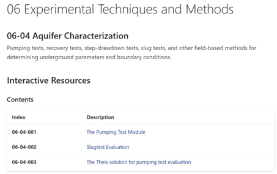

<!-- page_id: 02010000_en -->
<!-- parent_id: 02000000_en -->
<!-- lang_code: en -->

# Catalog of Interactive Document
Catalog of Interactive Document

# iNUX Interactive Documents  
## Web Catalog of Digital Learning Resources

*15 December 2025 – Version 1.0*

**Thomas Reimann¹, Navneet Sinha¹, Rudolf Liedl¹, Markus Giese²,  
Roland Barthel², Edith Grießer³, Steffen Birk³,  
Oriol Bertran⁴, Daniel Fernàndez-Garcia⁴**

¹ TU Dresden, Institute for Groundwater Management  
² University of Gothenburg, Department of Earth Sciences  
³ University of Graz, Department of Earth Sciences, NAWI Graz Geocenter  
⁴ Polytechnical University of Catalonia, Department of Civil and Environmental Engineering  

> **Disclaimer**  
> This document represents a static snapshot of the *iNUX Web Catalog of Digital Learning Resources* at the time of publication.  
>
> The most recent online version is available at:  
> <https://github.com/gw-inux/iNUX-Handbook/tree/main/Catalog>
>
> **Access the live catalog:**  
> <https://gw-inux.github.io/iNUX-Interactive-Documents>

---
## Content

1. [Purpose and Scope](#1-purpose-and-scope)  
2. [Concept of the Interactive Catalog](#2-concept-of-the-interactive-catalog)  
3. [Structure and Organization of the Catalog](#3-structure-and-organization-of-the-catalog)  
4. [Use Cases](#4-use-cases)  
5. [Technical Realization](#5-technical-realization)  
6. [Outlook](#6-outlook)  
7. [Acknowledgment](#acknowledgment)  
8. [References](#references)

## 1. Purpose and Scope

This document introduces the interactive catalog of digital learning
resources developed within the iNUX project. INUX is an ERASMUS+
cooperation project involving the Universities of Barcelona, Graz,
Gothenburg, and Dresden, aiming to provide an interactive digital
learning environment for hydrogeology and groundwater management. The
catalog is implemented as a public GitHub repository with an associated
GitHub Pages website, providing structured and platform-independent
access to a collection of interactive educational documents in
hydrology, hydrogeology, and related fields.

The purpose of this document is to describe the concept, structure, and
use of the catalog and to present its current state as of December 2025.
The catalog itself is designed as a living resource that can be
continuously extended and updated beyond the iNUX project's initial
funding period from 2022 to 2025. This document represents a snapshot of
the catalog as of 23. December 2025. The most recent, continuously
updated version is available online on the project's GitHub Pages
website.

🠚
[**https://gw-inux.github.io/iNUX-Interactive-Documents**](https://gw-inux.github.io/iNUX-Interactive-Documents)

## 2. Concept of the Interactive Catalog

The interactive catalog is a structured collection of interactive
documents that support different forms of learning and teaching. It is
intended as a flexible overview about a collection of educational
materials that can be (re)used, combined, and adapted to different
contexts.

The catalog contains mainly two main types of interactive documents:

- **Jupyter Notebooks**, which provide transparent, executable, and
  modifiable documents. These are particularly suited for advanced
  students, educators, and users who wish to explore methods in more
  depth or adapt the material for their own teaching. They are mainly
  intended for local execution, e.g., in a live demonstration during
  onsite/online classes.

- **Streamlit applications**, which provide server-based interactive
  tools. Some of these applications are deployed via the Streamlit
  sharing platform, while all can also be executed locally from the
  repository. They are designed for intuitive use without requiring
  Python programming expertise. Streamlit applications are further
  divided into **single-page apps and multipage apps, which contain
  several single-page** apps in a specific educational context. These
  apps are mainly intended for self-studies...

Each thematic section of the repository also contains associated
materials like questions that are organized in a structured way and can
be used flexibly for self-learning, classroom activities, or integration
into external learning-management systems. Please refer to the
documentation of the iNUX question pool for further information
\[Reimann, Giese et al. 2025\].

The catalog is designed to provide a quick and comprehensive overview of
the iNUX interactive educational materials. The catalog addresses a
broad range of target groups, including:

- Bachelor\'s and Master\'s students in geosciences and environmental
  engineering,

- University lecturers and educators,

- Professionals in groundwater management and consulting,

- Lifelong learners in continuing education, and more.

Accordingly, it supports different use cases like

- self-paced learning (learners use the catalog to identify documents
  for their specific interest,

- use in academic teaching by educators, to enhance individual topics
  with additional interactive documents,

- use in academic teaching by students, to provide additional
  information and insights to an individual topic,

- Professional users for, e.g., continuing education or internal
  education.

## 3. Structure and Organization of the Catalog

The catalog follows the project's categorization framework as documented
in the categorization report \[Reimann et al. 2025\]. This framework
provides a coherent thematic structure that is aligned with standard
groundwater curricula and commonly used textbook concepts.

Each resource is identified using a systematic 7-digit numbering scheme:

- The first two digits of the identifier refer to the main category,

- The second two digits refer to the subcategory,

- Further, within each subcategory, individual documents are indexed
  using an increasing three-digit number.

For example, a document with the ID 06-04-001 belongs to the top
category Experimental Techniques and Methods (06), the subcategory
Aquifer Characterization (04), and the consecutively numbered index 001;
see also Figure 1. This approach ensures a clear thematic assignment,
consistent referencing, and long-term extensibility of the catalog.

*Figure 1: Screenshot of the iNUX catalog with the categorization.*

## 4. Use Cases

The GitHub-Pages website provides extensive search and navigation
functionality. For each category and subcategory, users can see how many
resources are available and access a concise overview. Resources are
indexed using keywords, allowing users to search across categories and
topics. In addition, the catalog specifies the intended use context
(e.g., online or classroom teaching) and lists prerequisites, allowing
the users to quickly identify relevant materials and select resources
that match their specific learning or teaching needs. Figure 2 shows
some of the information that the catalog provides for each interactive
document.

*Figure 2: Screenshot of the overview box for a Streamlit app.*

Within each section, the interactive documents are presented with short
descriptions and direct links. Depending on the resource type, these
links point either to a deployed Streamlit application or to an
executable environment such as MyBinder for notebook-based resources.
This supports efficient discovery and reuse of interactive materials by
the wide range of intended users.

## 5. Technical Realization

All resources are hosted in a public GitHub repository. The catalog is
presented through a GitHub Pages website generated directly from this
repository using the Jekyll static site generator, which converts
structured text files into a fast, secure, and easily maintainable
static website without the need for a backend server
(<https://jekyllrb.com>). The site uses the *Just the Docs* theme, a
documentation-focused Jekyll theme that provides built-in navigation,
search, and versioning features, making it well-suited for organizing
and presenting structured educational content
(<https://just-the-docs.github.io/just-the-docs/>). As a result, the
catalog is self-updating, with new resources and revisions automatically
reflected on the website.

To support sustainable growth and collaboration, the project developed
the Catalogger tool (https://inux-catalogger.streamlit.app/). This tool
enables both internal and external contributors to provide new resources
in a standardized format, allowing efficient integration of additional
materials and enhancing the catalog over time.

The technical approach through the GitHub repository ensures
transparency, version control, and long-term accessibility, while
relying exclusively on open-source tools and platforms. The catalog
itself is accessible across different platforms and devices, including
desktop computers, tablets, and mobile phones. It is designed to be
continuously extended and refined as new resources are developed and
existing ones are improved.

This document presents only the catalog\'s current state at the time of
publication. The live, continuously updated version is available online
at the project's GitHub Pages website:
https://github.com/gw-inux/iNUX-Handbook/tree/main/Catalog.

## 6. Outlook

Based on the experience gained during the project, future development of
the catalog will focus on further optimization of discoverability and
reuse, for example through more formalized use of keywords and metadata.
The modular structure of the catalog allows such enhancements to be
implemented without restructuring existing content.

# Acknowledgment

This document was created within the ERASMUS+ project iNUX.

*This project is co-funded by the European Union. However, the views and opinions expressed are solely those of the author(s) and do not necessarily reflect those of the European Union or the National Agency DAAD. Neither the European Union nor the granting authority can be held responsible for them.*

# References

Reimann, Giese (2025). Electronic Questions and Assessments in iNUX:
Foundations, Design Principles, and Implementation Workflows.

Reimann, Giese, Barthel, Birk, Fernàndez-Garcia (2025). Concept for
Categorization of Hydrogeology and Groundwater Management Contents.

