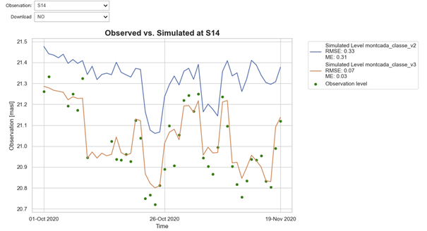

<!-- page_id: 02030200_en -->
<!-- parent_id: 02030000_en -->
<!-- lang_code: en -->

# Example-Applied Hydrogeology

*30 December 2025; v1.0*

**Oriol Bertran¹, Daniel Fernàndez-Garcia¹, Thomas Reimann²,  
Rudolf Liedl², Markus Giese³, Roland Barthel³, Edith Grießer⁴,  
Steffen Birk⁴**

¹ Polytechnical University of Catalonia, Department of Civil and Environmental Engineering  
² TU Dresden, Institute for Groundwater Management  
³ University of Gothenburg, Department of Earth Sciences  
⁴ University of Graz, Department of Earth Sciences, NAWI Graz Geocenter  

---

> **Disclaimer**  
> This document represents a static snapshot of the *iNUX Best Practice Examples for Implementation in Education* at the time of publication.  
>
> The most recent online version is available at the gw-inux GitHub repository:  
> <https://github.com/gw-inux/iNUX-Handbook/tree/main/Best_Practice>

---

## Content

1. [Purpose and Scope](#purpose-and-scope)  
2. [Best Practice Example – Comparing Simulated and Observed Values Using a Python Tool for MODFLOW 6](#best-practice-example--comparing-simulated-and-observed-values-using-a-python-tool-for-modflow-6)  
3. [Acknowledgment](#acknowledgment)  
4. [References](#references)  

---

## Purpose and Scope

**Goal of the report**  
To document how interactive digital tools were implemented in hydrogeology education (Applied Hydrogeology), using concrete examples that illustrate transferable best practices. The focus is on didactic integration, practical effort, and lessons learned, rather than on technical details of the tools themselves.

**Target audience**  
University teachers, course coordinators, and educational developers interested in adopting interactive tools in lectures, exercises, or complete courses.

**Best practice examples for Applied Hydrogeology**

The example presented in this report represent a selected subset of best practices and is intended to illustrate typical use cases and transferable practices. A more comprehensive and continuously updated collection of interactive tools, documentation, and accompanying resources is available online via the project's web platform under:  
<https://github.com/gw-inux/iNUX-Handbook/tree/main/Best_Practice>

---

## Best Practice Example -- Comparing Simulated and Observed Values Using a Python Tool for MODFLOW 6

This example presents a best-practice implementation of an interactive Python-based tool developed in a Jupyter Notebook environment to support the evaluation and verification of groundwater model results generated with MODFLOW 6, aimed at advanced master's students and professionals.

### 1. Short Description of the Interactive Educational Tool

The interactive tool **OBSvSIM.ipynb** (available in the iNUX interactive materials with index 08-09-001 and online under <https://github.com/gw-inux/Jupyter-Notebooks/blob/main/06_Groundwater_modeling/OBSvSIM.ipynb>), guides users through the evaluation of a groundwater flow model generated with MODFLOW 6. Users can load any model output file, specified as `<model_name>.ob.gw_out_head.csv`, and compare it to the corresponding observation values. The input files must follow a specific structure, which is detailed in **Section 5: Implementation effort and technical setup**.

The tool provides several capabilities for students and professionals, including:

1) **General estimation of model calibration**  
Users can plot observed versus simulated values in a scatter plot along with a 1:1 reference line. Results can be displayed for all loaded models together or by interactively selecting a single model (Figure 3).

*Figure 3: Observed versus simulated values for all loaded models (left) and for a single selected model (right).*

2) **Assessment of model quality at individual observation points**  

For any selected observation point (e.g., piezometers or wells), users can compare real observation values with the simulated outputs from the selected model. In addition to the graphical comparison, the tool calculates and displays the mean error (ME) and the root mean squared error (RMSE) for the selected point and model (Figure 4).

*Figure 4: Observed versus simulated groundwater head values for a specific observation point (S14), including visual assessment and computed error metrics (ME and RMSE).*

3) **Spatial visualization and interactive temporal analysis**  

For any selected model, observation points can be mapped with:
- a radius proportional to the RMSE relative to the simulated value,  
- a color code indicating the error sign (red for positive RMSE, blue for negative RMSE).

Users can click on any observation point to display the temporal evolution of observed and simulated heads along with the exact RMSE value (Figure 5).

*Figure 5: Visualization of model performance for a selected model. Top: observation points mapped with radius proportional to RMSE and color indicating error sign (red: positive, blue: negative). Bottom: temporal evolution of observed and simulated heads for a selected observation point, with exact RMSE value displayed.*

### 2. Context and educational setting

This interactive tool was introduced to advanced students in the *Flow and Transport Modeling in Porous Media (250803)* course of the Geotechnical Engineering Master's program at UPC (December 2024), as well as to professionals from consultancy companies interested in transitioning to open-source groundwater flow modeling, such as FloPy (April 2025).

The master's course is mandatory for completing the Geotechnical Engineering Master's program, regardless of the specialization chosen, and the class in which the tool was presented included approximately 20 students. The students came from diverse backgrounds, including Earth Sciences (Geology) and Engineering (e.g., Environmental and Civil Engineering). Consequently, both numerical and geological conceptualization varied among the students, which is common in master's programs.

To mitigate these differences, this particular session was scheduled in the last quarter of the course, once students were already familiar with general hydrogeological concepts (e.g., hydraulic conductivity and storativity) as well as the specific methodologies behind groundwater flow models (e.g., finite difference methods and flow modeling).

To efficiently illustrate the impact of parameter variability within the limited class time, a second model output (model 2) was generated externally through a simple post-processing routine applied to the simulated head values of the first model output (model 1), rather than by executing a new numerical simulation. This synthetic modification was introduced exclusively for educational purposes, enabling rapid comparison between two contrasting model responses. Using the interactive tool, participants analyzed both outputs, reflected on which model appeared better calibrated, and identified spatial and temporal areas where model performance was weakest.

### 3. Learning objective(s)

**Conceptual understanding of the groundwater flow outputs**
- Students and professionals should be able to interpret and evaluate whether the outputs of their groundwater flow model are satisfactory when compared to actual observations.

**Interpretation and decision-making**
- Users should be able to identify the weakest points or areas of the model that require further attention for recalibration. By linking the generated plots to hydrogeological concepts, they should also be able to determine whether these areas require more or less water drainage or, translated into model parameter inputs, adjustments to hydraulic conductivity or transmissivity values within the model.

### 4. Tool integration and didactic design

The interactive tool was integrated as a hands-on, student-driven activity conducted during a scheduled class session, following the completion of the theoretical components of the course. Its use was deliberately placed in the last quarter of the course, once students had acquired the necessary background in hydrogeological concepts and groundwater flow modeling methodologies.

The session began with a short instructor-led introduction, during which the general objectives of the activity and the specific objectives of the interactive tool were explained. Following this initial introduction, the instructor and students jointly built a transient groundwater flow model using MODFLOW 6, employing either ModelMuse or FloPy, depending on user needs and preferences. During this phase, the instructor formulated key questions related to the modeling setup, such as: (i) which model packages need to be modified when shifting from a steady-state to a transient simulation; (ii) the difference between a model and a simulation; (iii) the main components of a groundwater flow simulation; (iv) the overall workflow for building a groundwater flow model.

Once the model was built and the outputs were generated, the instructor introduced several available tools for model result evaluation (e.g., plot_array and plot_vector from PlotMapView in FloPy), as well as the interactive tool of interest, specifically designed for model evaluation and verification. For this tool, the instructor emphasized its prerequisites, including the required input structure and time reference consistency, and demonstrated live how to load observation data and one or more model output files.

To enrich the analysis and comparison, a second model output was synthetically generated by applying a random fluctuation to the simulated head values of the first model output. This setup provided a controlled framework for comparative evaluation.

Participants were then encouraged to:
- Compare model performance using scatter plots and error metrics,
- Explore spatial patterns of model error through interactive maps,
- Analyze the temporal evolution of observed and simulated heads at individual observation points.

The activity concluded with a discussion, led by the instructor, in which students reflected on which model was better calibrated, identified the weakest areas of the models, and linked observed discrepancies to potential hydrogeological explanations and parameter adjustments. Thus, learning was reinforced through guided interpretation, peer discussion, and instructor feedback.

This combination of guided exploration, followed by open analysis and structured reflection, proved effective in reinforcing conceptual understanding of groundwater model calibration while promoting critical thinking and decision-making skills.

### 5. Implementation effort and technical setup

Several factors should be considered prior to implementing the tool:

**A) General Requirements**

- **Required infrastructure**

  The tool is implemented as a Jupyter Notebook–based application. Users therefore require a local Python installation and a working Jupyter Notebook or JupyterLab environment. Jupyter can be installed either via a Conda distribution or using pip (e.g., `pip install jupyterlab`).

  Both instructors and participants should be aware that when installing jupyterlab via pip from the terminal, particularly on Windows systems, the Python executable must be correctly added to the system PATH environment variable. If this option is not selected during installation, it must be configured manually to ensure that Python can be accessed from the command line.

  If Python was not added to the PATH during installation, the following steps can be used to configure it manually (the same approach applies when adding a directory containing MODFLOW executables):

  - Open *Edit the system environment variables*.
  - Select *Environment Variables*.
  - Under *User variables*, select *Path* → *Edit* → *New*.
  - Add the full path to `python.exe` (or to the folder containing the executables).
  - Confirm and apply all changes.

- **Required libraries**

  All required Python libraries are imported in the first cell of the Jupyter Notebook. However, several dependencies used by the tool are not included in a default Python installation (e.g., `folium` and `geopandas`). To simplify setup, the first cell of the notebook also includes a helper function that automatically installs any missing libraries when they cannot be imported. This minimizes manual dependency management and reduces setup time for first-time users.

- **VSCode Users**

  When running the tool in Visual Studio Code, users may encounter the following message in the final cell, related to the rendering of mapped results:  
  *“Make this Notebook Trusted to load map: File → Trust Notebook”*

  This is related to VS Code workspace security, not to the notebook itself. To fix it:

  1. Open the folder containing this notebook as a workspace (*File → Open Folder*).
  2. When prompted, choose *Trust this workspace* (or use *Ctrl + Shift + P* → *Workspace: Manage Workspace Trust*).

  Once the folder is trusted, Folium maps, HTML content, and widgets will render correctly. This issue does not occur when running the notebook in Jupyter Lab or Jupyter Notebook in the browser.

**B) Specific Requirements of the Tool**

- **Real observation values format**

  The tool requires the input observation data to follow a specific tabular structure, as illustrated in the example Excel file available in the iNUX repository:  
  <https://github.com/gw-inux/Jupyter-Notebooks/tree/main/06_Groundwater_modeling/DATA/obs_vs_simulation>

  For each observation point, two columns must be provided:
  - `<observation_name>_time`: time values of the observations,
  - `<observation_name>_obs`: corresponding observed head values.

  The first two rows of each observation column pair are reserved for spatial metadata: the first row contains the X coordinate and the second row contains the Y coordinate, with the labels **X:** and **Y:** specified in the first column and their respective numeric values in the second column.

  While the inclusion of X and Y coordinates is optional, omitting them limits the tool's capabilities, particularly those related to spatial visualization and mapping of observation points.

  It should be noted that these data are typically already available on the user's computer as part of the model development process; the tool simply requires that they follow a defined structure to enable automated processing and visualization.

- **Awareness of the starting point of the model in numeric** (e.g., 01 October 2020 corresponds to 44105 when using serial date formats).
- **Ensuring that all model output files intended for comparison are stored in the same directory.**

The preparation effort required from the instructor strongly depends on the selected case study. When using the example data provided with the tool, the preparation effort is low. However, when applying the tool to a different case study, the specific requirements described above must be taken into account, and the preparation effort may increase from low to high.

Since this tool is intended for advanced students and professionals, the required level of instructor expertise in groundwater flow modeling is intermediate to advanced. Although the tool itself is straightforward and easy to use, the model construction process and the follow-up questions related to model evaluation and interpretation may require solid knowledge of groundwater flow modeling principles and basic coding skills.

### 6. Observed outcomes and feedback

The use of this tool in teaching *Flow and Transport Modeling in Porous Media* helped the instructor effectively link hydrogeological concepts introduced in theoretical classes with the practical modeling of groundwater flow. By directly interacting with model inputs and outputs, students were able to better understand the role and sensitivity of hydrogeological parameters within a groundwater flow model.

This integration significantly facilitated conceptual understanding, as students could immediately observe how changes in parameters influenced model behavior and simulation results. As a result, abstract theoretical concepts became more tangible and easier to interpret within a real modeling framework. In summary, the tool enabled a more dynamic and exploratory learning experience. In conventional settings, students often focus on reproducing results rather than understanding model behavior. In contrast, this approach emphasized interpretation, critical thinking, and diagnostic reasoning.

Beyond its clear educational benefits for advanced Master's students, the tool also proved valuable as a practical verification and quality-control resource for professionals. It can be used to evaluate and compare model results generated with MODFLOW 6, whether implemented through ModelMuse or FloPy. As with its educational use, applying the tool to a specific study site requires a level of preparation effort comparable to that expected from an instructor, particularly when adapting input data and model settings.

### 7. Lessons learned and recommendations

**Key Lessons Learned**
- Interactive visualization of model outputs significantly enhances conceptual understanding of groundwater flow processes.
- Linking model diagnostics to hydrogeological theory encourages critical thinking.
- Allowing students to explore model weaknesses promotes meaningful discussions on uncertainty and model limitations.

**Recommendations and Best Practices**

- **What worked particularly well**
  - Using real case studies familiar to the students increased relevance and motivation (e.g., a nearby aquifer where students conducted fieldwork or pumping tests, or an aquifer previously studied in another course).
  - Visual comparison between observed and simulated data supported interpretation and discussion.
  - Providing immediate feedback through interactive plots encouraged exploration and reinforced conceptual understanding.

- **What should be avoided**
  - Introducing the tool without prior review of basic groundwater modeling concepts.
  - Assuming uniform coding skills among students.

- **Transferability to other courses**
  - With minor adaptations, the tool can support both teaching and professional training contexts.
  - Professionals are likely to focus on reusing the tool independently across different study sites, whereas students should primarily focus on understanding groundwater flow modeling principles and the role of hydrogeological parameters in controlling system responses.

- **Suggestions for first-time adopters**
  - Begin with the provided example dataset before introducing site-specific case studies.
  - Allocate sufficient time for technical setup and troubleshooting, particularly when an *ad hoc* study site is to be incorporated.

---

## Acknowledgment

This document was created within the ERASMUS+ project iNUX.

*This project is co-funded by the European Union. However, the views and opinions expressed are solely those of the author(s) and do not necessarily reflect those of the European Union or the National Agency DAAD. Neither the European Union nor the granting authority can be held responsible for them.*

---

## References

Reimann, T., Giese, M., Barthel, R., Birk, S., Fernàndez-Garcia, D. (2025). *Concept for Categorization of Hydrogeology and Groundwater Management Contents.*  
<https://github.com/gw-inux/iNUX-Handbook/tree/main/Categorization>