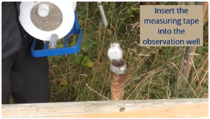

<!-- page_id: 02050000_en -->
<!-- parent_id: 02000000_en -->
<!-- lang_code: en -->

# Video Channel

iNUX YouTube Channel – Concept, Purpose, and Use Cases

*30 December 2025; v1.0*

**Markus Giese¹, Roland Barthel¹, Thomas Reimann², Edith Grießer³,  
Steffen Birk³, Oriol Bertran⁴, Daniel Fernàndez-Garcia⁴**

¹ University of Gothenburg, Department of Earth Sciences  
² TU Dresden, Institute for Groundwater Management  
³ University of Graz, Department of Earth Sciences, NAWI Graz Geocenter  
⁴ Polytechnical University of Catalonia, Department of Civil and Environmental Engineering, Spain  

---

> **Disclaimer**  
> This document represents a static snapshot of the *iNUX YouTube Channel* at the time of publication.  
> The video channel can be reached under:  
> **https://www.youtube.com/@iNUXvideochannel**  
>
> The most recent online version is available at the gw-inux GitHub repository:  
> <https://github.com/gw-inux/iNUX-Handbook/tree/main/Videos>

---

## Content

1. [Introduction](#1-introduction)  
2. [Purpose and Design Principles](#2-purpose-and-design-principles)  
3. [Overview, Use, and Technical Implementation](#3-overview-use-and-technical-implementation)  
4. [Acknowledgment](#acknowledgment)  

# 1 Introduction

The iNUX (Interactive Understanding of Groundwater Hydrology and
Hydrogeology) YouTube channel supports the project's objective of
fostering an interactive and concept-driven understanding of groundwater
hydrology and hydrogeology. Complementing interactive tools, digital
assessments, and structured teaching materials, the channel provides
short educational videos that visualize essential hydrogeological
processes and concepts.

In contrast to conventional lecture recordings, most iNUX videos rely on
text-based visualizations rather than spoken narration. This design
facilitates straightforward translation into multiple languages and
supports use in diverse educational contexts. As a result, the videos
can be reused flexibly in international courses, blended-learning
settings, and self-paced study formats.

The video collection includes a range of formats, from conceptual
animations and visual explanations derived from field courses to
screencasts embedded in interactive tutorials and Streamlit-based
applications. In this way, the YouTube channel forms an integral part of
the broader iNUX learning ecosystem, providing concise visual
explanations that complement interactive exploration and hands-on
learning activities.

# 2 Purpose and Design Principles

The iNUX videos are designed to support teaching and learning in
groundwater hydrology and hydrogeology by providing concise, visually
oriented explanations of key concepts. Their primary purposes are to:

- introduce or reinforce fundamental hydrogeological concepts,

- support self-paced and independent learning,

- complement interactive Streamlit applications and Jupyter-based
  tutorials,

- be embedded flexibly in lectures, courses, and digital learning
  modules.

A design principle of the iNUX video channel is the use of text-based
visualizations instead of spoken narration. This approach enables
straightforward translation, adaptation to multilingual teaching
environments, and reuse across international courses without the need
for audio processing or re-recording. As a result, the videos are well
suited for both formal academic instruction and open educational
contexts.

The channel covers different types of educational videos, including
visual material derived from field courses that shows hydrogeological
methods, short screencasts illustrating the use of e.g., software for
groundwater modeling workflows, and more. Rather than duplicating
existing video resources, the iNUX videos focus on content that directly
supports the project's interactive tools and teaching concepts. Overall,
the videos follow the same guiding principles as the broader iNUX
learning ecosystem: clarity, accessibility, conceptual accuracy, and
reusability.

# 3 Overview, Use, and Technical Implementation

The iNUX videos are primarily used as supporting learning elements
within a broader teaching and learning workflow. Their technical
simplicity allows them to be integrated into different educational
contexts with minimal effort.

In lecture-based teaching, the videos are typically used as short
introductions or targeted clarifications of specific topics. They can be
embedded directly into presentation slides or accessed via links during
class to support discussion and conceptual explanation. Within
interactive Streamlit applications and Jupyter-based tutorials, videos
are used to prepare learners for hands-on interaction, providing a
concise visual overview before users explore models, simulations, or
exercises.

The videos are also used beyond the classroom. Students can access them
independently to review key concepts, prepare for exercises or
assessments, or revisit material after field courses. In field-based
teaching, selected videos serve as preparatory material or as follow-up
resources to help contextualize observations made on site.

From a technical perspective, the videos are hosted on YouTube and can
be embedded or linked across platforms without additional software
requirements. Their silent, text-based format enables straightforward
reuse in different teaching environments and supports integration into
web-based tools and open educational platforms.

Figure 1 illustrates two representative examples from the channel. These videos demonstrate typical hydrogeological field activities and can be directly embedded into interactive learning environments. Each video is accessible via a direct link and can be reused independently or in combination with other iNUX materials.

### Example videos (Figure 1)

**Left: measuring groundwater heads**  

Video link: <https://www.youtube.com/watch?v=FFo5jfkIM5c>

**Right: performing a slug test**  

Video link: <https://www.youtube.com/watch?v=McAUe3cOYKs>

*Figure 1: Two example videos from the iNUX YouTube channel (clickable links). Left: measuring groundwater heads. Right: performing a slug test.*

The iNUX YouTube channel comprises a growing collection of short educational videos that support different teaching and learning contexts within groundwater hydrology and hydrogeology. The iNUX video channel is available under:

🠚 <https://www.youtube.com/@iNUXvideochannel>

In addition to standalone use, videos are explicitly integrated into Streamlit-based applications, where they serve as concise introductions or guided explanations within a broader interactive workflow, e.g., in the Streamlit app about Slugtest evaluation (<https://slugtest-multilingual.streamlit.app/>; Figure 2).

*Figure 2: The Streamlit app about Slugtest evaluation embeds a video from the iNUX YouTube channel.*

In addition to the publicly visible videos, the iNUX YouTube channel also hosts a set of screencast videos that form the basis of several Streamlit-based tutorials, as illustrated in Table 1. These screencasts are intended to guide users through specific workflows, such as numerical modeling and postprocessing tasks, and are accessed primarily through their integration into the corresponding interactive applications. While technically hosted on the iNUX YouTube channel, these screencast videos are not listed publicly on the channel and are instead made available contextually within the associated Streamlit tutorials. Table 1 provides an example illustrating how screencasts are embedded in a Streamlit app to support numerical modeling and interpretation tasks.

### Table 1: Example of a Streamlit application making use of iNUX screencasts

| Name | Link | Video implementation |
|---|---|---|
| Modflow-2005/MODELMUSE Tutorial: 2D Steady State Groundwater Flow for a Synthetic Catchment | <https://modflow-tutorial-2d-synthetic.streamlit.app/> | 5 videos showing the basic steps in groundwater modeling with the software MODELMUSE |
| Tutorial: Numerical model of a pumping test | <https://modflow-tutorial-2d-theis.streamlit.app/> | 7 videos showing the different steps and methods to setup, run, and evaluate a numerical groundwater model |
| Tutorial – Numerical computation of solute transport: Demonstration of MT3D applications | <https://mt3d-tutorial-2d-synthetic.streamlit.app/> | 8 videos that show different steps in the workflow, embedded in a complete Streamlit app with additional assessments and interactive plots |

---

# Acknowledgment

This document was created within the ERASMUS+ project iNUX.

*This project is co-funded by the European Union. However, the views and opinions expressed are solely those of the author(s) and do not necessarily reflect those of the European Union or the National Agency DAAD. Neither the European Union nor the granting authority can be held responsible for them.*
